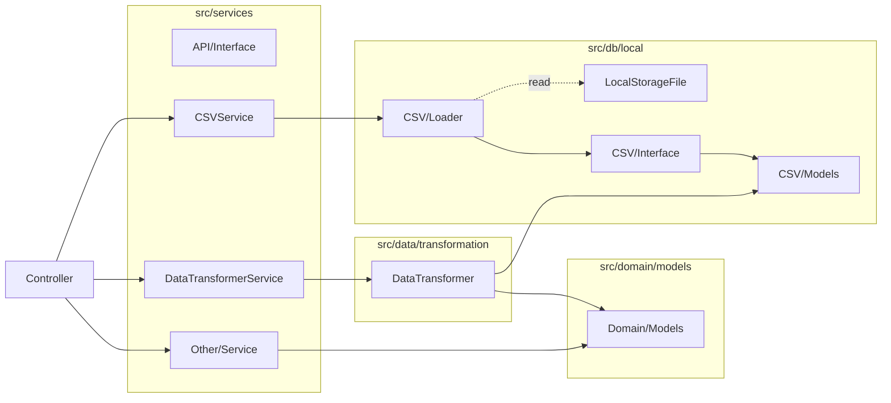

csvを読み取り、ひとつのcsv単位でmodelを作成し、読み込みを完結させる。
すべてのcsvの読み取り後に、それらのcsv/modelsをdomain/modelsへtransformする（relationの処理など）流れのための設計。



user usage

```python
class Controller:
    # ...existing code...

    def load_csv(self):
        csv_loader = CsvLoader()
        csv_models = csv_loader.load()
        return csv_models

    def transform_to_domain_model(self, csv_models):
        domain_models = transform_to_domain_model(csv_models)
        return domain_models

controller = Controller()
csv_models = controller.load_csv()
domain_models = controller.transform_to_domain_model(csv_models)

items = domain_models.items
mixers = domain_models.mixers
# ...other domain model usages...
```
