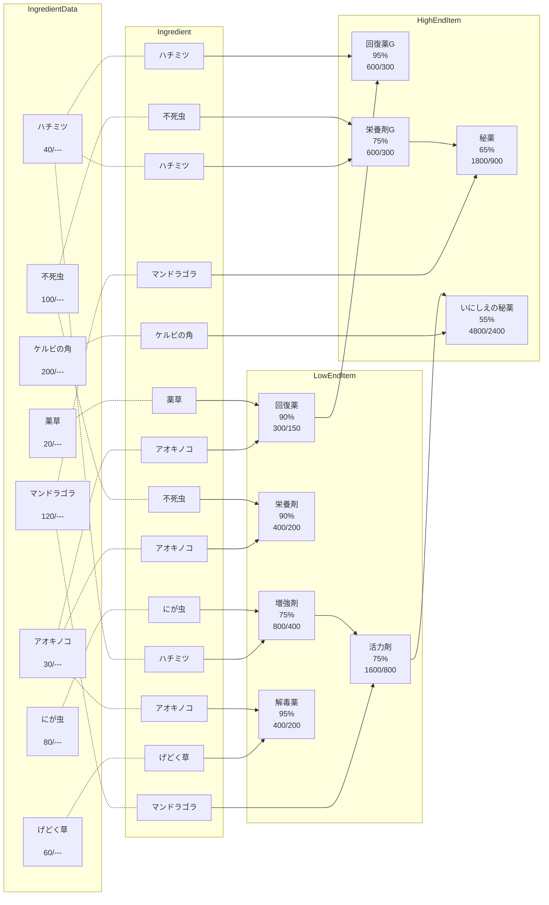

## 概要

モンスターハンターの調合をモチーフにした、  
需要に合わせて調合の実行計画を作成するアプリケーション  
適切な調合計画を立てる。

- 目的
    - 所持金が最大

- データセット内で普遍的な条件
    - アイテム数
    - 収率
    - 買値と売値

- 計算条件ごとに変わる
    - 初期所持金
    - 各原料情報
        - 初期在庫
        - リードタイム  ※すぐに購入できるわけではない
    - 調合設備の特性
        - 台数
        - 調合の容量
        - 調合の速度
        - 段替え時間
    - 需要クエリ
        - 需要の数
        - 各需要の情報
            - 日時
            - 対象アイテム
            - 数量

---

## アイテム情報と調合ツリー

商品名 
調合収率 
買値 / 売値 

